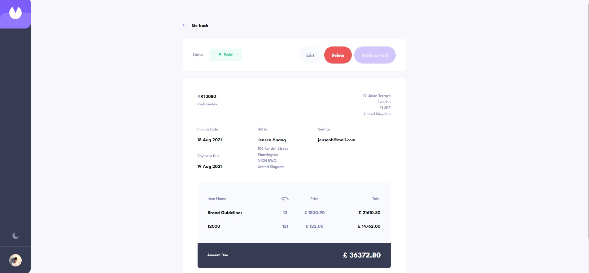

# Billing Application - React

This is a standalone project that implements a billing application using the React JavaScript library. The application allows users to create, manage, and track invoices. 

### Screenshot

## Features

- Create, edit, and delete invoices
- Responsive user interface for easy access on different devices
- Server-side storage of invoice data for persistence and security
- Search and filter invoices

## Installation

1. Clone the repository:

git clone https://github.com/yourusername/billing-application-react.git

2. Change to the project directory:

cd billing-application-react

3. Install the required dependencies:

npm install

4. Start the development server:

npm start

The application will now be accessible at `http://localhost:3000`.

## Technologies

- React for building the user interface
- Axios for handling API requests

## Contributing

Pull requests are welcome. For major changes, please open an issue first to discuss what you would like to change.

Please make sure to update tests as appropriate.
